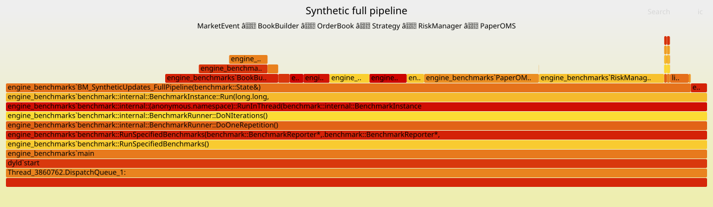

# prediction-market-arbitrage-engine

A C++20 market data, strategy evaluation, and simulated order flow engine for prediction markets.

The project builds the infrastructure layer between raw market data and trading decisions: normalized event ingestion, deterministic local book reconstruction, constraint-based arbitrage evaluation, pre-trade risk checks, and simulated order submission.

The current focus is deterministic market-state reconstruction, strategy evaluation, and repeatable performance measurement. The architecture is designed to support replay, simulation, and eventual live ingestion without changing the core engine path.

---

## Architecture

Data flows through a fixed pipeline:

```text
Polymarket JSON
  → adapter
  → MarketEvent
  → SPSC queue
  → BookBuilder
  → OrderBook
  → Strategy
  → OrderIntentBuilder
  → RiskManager
  → PaperOMS
```

**Polymarket adapter** translates raw `/book` snapshot JSON into normalized `MarketEvent` structs. It is the only place venue-specific formatting is handled. It also parses Polymarket's string-encoded decimal prices into fixed-point integers.

**MarketEvent** is the engine's internal data format. Everything becomes a `MarketEvent` before entering the pipeline. This lets the same downstream path handle snapshots, WebSocket updates, replay files, and synthetic test events without modification.

**SPSC queue** is the handoff between producer and consumer. The adapter produces events; the BookBuilder consumes them.

**BookBuilder** owns sequencing. It checks whether each incoming event is next in sequence, rejects duplicates, detects gaps, and drops unsupported event types. In the normal pipeline, the OrderBook receives events only after BookBuilder validates sequencing and event support.

**OrderBook** maintains aggregate price-level state. It stores bid and ask quantity by price level and tracks best bid/ask.

**Strategy** consumes reconstructed book state. It has no knowledge of JSON, HTTP, or anything external. It evaluates configured market constraints and produces executable opportunities.

**OrderIntentBuilder** converts strategy opportunities into internal buy/sell order intents.

**RiskManager** performs pre-trade checks before simulated order submission. It validates enabled markets, price bounds, quantity limits, and notional limits.

**PaperOMS** tracks simulated order lifecycle state: accepted orders, fills, cancels, remaining quantity, and terminal order status.

---

## Design Decisions

### Aggregate price-level book, not per-order

The book exposes `set_level(side, price, quantity)` and `clear_level(side, price)` rather than `insert_order`, `cancel_order`, and `modify_order`.

Polymarket's public book data is aggregate level data. Individual public order IDs are not present in the feed. Modeling per-order state for market data would mean tracking things the data does not actually provide. The aggregate model reflects what the engine receives.

Internal order IDs still exist, but only for the engine's own simulated order flow inside `PaperOMS`.

### Normalized events instead of direct JSON-to-book calls

The adapter does not write directly into the OrderBook. It produces `MarketEvent` structs that move through the queue and BookBuilder first.

The consequence is that the engine does not need to change to support replaying recorded events, running synthetic test scenarios, or eventually handling WebSocket deltas. Those are all different sources of the same event type.

### BookBuilder owns sequencing, OrderBook owns state

Sequence validation — what is next, what is a duplicate, what is a gap — is a market data pipeline concern. Book mutation is a state concern.

Mixing them makes both harder to test in isolation and harder to reason about when something goes wrong. BookBuilder handles sequencing. OrderBook handles state.

### Fixed-point integers for prices

Prices are stored as scaled integers:

```text
1.0  → 10000
0.52 → 5200
```

Floating-point arithmetic is not used on the pricing path. This avoids accumulating rounding error across operations and makes equality comparisons between price levels safe.

### Internal market IDs in the core engine

The core engine uses compact internal market IDs.

External venue identifiers, such as Polymarket token IDs, belong at adapter and execution boundaries. Strategy, risk, and OMS components operate on `internal_market_id`.

This keeps the internal path stable:

```text
Strategy → Opportunity → OrderIntent → RiskManager → PaperOMS
```

Venue-specific IDs can be mapped back later by a registry or execution adapter.

### Namespace for the adapter, not a virtual interface

The Polymarket adapter is a namespace of stateless translation functions, such as `polymarket::parse_book_snapshot`, rather than a class implementing an `IMarketDataAdapter` interface.

A virtual interface makes sense when there are multiple runtime-selectable adapters. There is currently one venue. The abstraction belongs when there is a second adapter to justify it.

---

## What's Implemented

* Aggregate price-level order book with best bid/ask tracking
* `MarketEvent` model covering snapshot begin/end, level set, and level clear events
* `BookBuilder` with sequence validation, duplicate detection, and gap detection
* SPSC ring buffer for producer/consumer event handoff
* Polymarket `/book` snapshot adapter with fixed-point decimal parsing
* Real Polymarket CLOB JSON fixture reconstruction test
* Constraint-based arbitrage strategy
* Order intent generation from strategy opportunities
* Pre-trade risk checks for market enablement, price bounds, quantity limits, and notional limits
* Paper OMS for simulated order acceptance, fills, cancels, and terminal order state
* Catch2 unit tests for individual components
* Integration tests for:

  * Polymarket JSON fixture → MarketEvent queue → BookBuilder → OrderBook
  * OrderBook → Strategy → OrderIntentBuilder → RiskManager → PaperOMS
* Google Benchmark performance harness
* Flame graph profiling workflow for the synthetic full-pipeline benchmark

---

## Strategy

The current strategy detects implication-chain violations across related prediction markets.

Example:

```text
P(BTC > $100k) should not be greater than P(BTC > $90k)
```

If the engine sees:

```text
Buy BTC > $90k at 0.50
Sell BTC > $100k at 0.60
```

then the strategy can identify a possible arbitrage path, estimate executable size from top-of-book liquidity, subtract configured fees, and produce an opportunity.

The strategy consumes reconstructed book state only. It does not parse JSON, call HTTP APIs, or know about Polymarket-specific fields.

---

## Tests

Run all tests:

```bash
./build/engine_tests
```

Run by component:

```bash
./build/engine_tests "[order_book]"
./build/engine_tests "[book_builder]"
./build/engine_tests "[spsc_queue]"
./build/engine_tests "[polymarket_adapter]"
./build/engine_tests "[risk_manager]"
./build/engine_tests "[paper_oms]"
```

Run integration tests:

```bash
./build/engine_tests "[integration]"
./build/engine_tests "[polymarket][fixture]"
```

The fixture reconstruction test uses a recorded Polymarket CLOB order book JSON fixture. It does not hit the live API during the test. This keeps the test deterministic while still validating against real exchange payload shape.

---

## Benchmarks

Benchmarks are run in Release mode using Google Benchmark.

The benchmark suite separates external boundary costs from the internal update-to-order path:

| Benchmark                         |                              Result | What it measures                                                                                |
| --------------------------------- | ----------------------------------: | ----------------------------------------------------------------------------------------------- |
| Polymarket fixture reconstruction |                            ~54.7 µs | Recorded Polymarket JSON → adapter → MarketEvent queue → BookBuilder → OrderBook                |
| Static trading loop               |                            ~1.19 µs | Prebuilt books → Strategy → OrderIntentBuilder → RiskManager → PaperOMS                         |
| Synthetic full pipeline           | ~69.8M updates/sec, ~14.5 ns/update | Pre-generated MarketEvent updates → BookBuilder → OrderBook → Strategy → RiskManager → PaperOMS |

These results are machine-dependent and should be treated as project-local measurements, not exchange-colocation latency claims.

### Benchmark Methodology

The Polymarket fixture reconstruction benchmark includes JSON parsing through `nlohmann::json`. It measures the external snapshot ingestion boundary, not the hot path.

The synthetic full-pipeline benchmark excludes JSON parsing and fixture loading. It uses a pre-generated deterministic stream of `MarketEvent` updates across two internal markets. Each measured update applies a book change, evaluates the configured constraint, builds order intents if an opportunity exists, runs risk checks, and submits approved orders to the paper OMS.

This benchmark is designed to measure the internal update-to-order path without the test harness doing expensive setup inside the measured loop.

Run benchmarks:

```bash
./build/engine_benchmarks
```

Run repeated benchmark measurements and write JSON output:

```bash
./build/engine_benchmarks \
  --benchmark_repetitions=30 \
  --benchmark_report_aggregates_only=true \
  --benchmark_format=json \
  > docs/benchmarks/benchmark_results.json
```

---

## Profiling

The synthetic full-pipeline benchmark can be profiled with sampled stack traces and rendered as a flame graph.

```markdown

```

The flame graph is intended to show where CPU time is spent inside the internal pipeline. It is not a latency benchmark by itself. Benchmarks measure timing; the flame graph explains where that time goes.

---

## Build

```bash
cmake -S . -B build -DCMAKE_BUILD_TYPE=Release
cmake --build build -j
```

If `nlohmann/json.hpp` is missing:

```bash
mkdir -p third_party/nlohmann
curl -L https://raw.githubusercontent.com/nlohmann/json/v3.11.3/single_include/nlohmann/json.hpp \
  -o third_party/nlohmann/json.hpp
```

---

## Fetching Real Polymarket Fixtures

A helper script can fetch a real Polymarket CLOB book and save it as a deterministic test fixture:

```bash
./scripts/fetch_polymarket_fixture.py \
  --event-slug "fed-decision-in-june-825" \
  --outcome Yes \
  --name fed_yes
```

The generated JSON fixture is committed and used by tests. Tests do not depend on live API availability.

---

## Current Limitations

* The engine does not currently place live orders.
* WebSocket delta ingestion is not implemented yet.
* The replay harness is not complete yet.
* The synthetic benchmark uses a deterministic generated update stream, not recorded historical market data.
* The paper OMS is a simulation component, not a real execution gateway.
* The strategy currently evaluates a narrow class of implication-chain opportunities.

---

## What's Next

### Replay harness

The next major step is a mechanism to record and replay normalized `MarketEvent` streams deterministically.

The replay harness should verify that the engine reconstructs the same book state and produces the same strategy decisions from the same input. This is the prerequisite for meaningful backtesting and historical strategy evaluation.

### Position and PnL tracking

PaperOMS currently tracks order lifecycle state. The next layer is position and PnL tracking from simulated fills.

### More realistic market-data simulation

The synthetic benchmark is useful for isolating the internal update-to-order path, but the next step is replaying larger recorded event streams and measuring performance over more realistic update distributions.

### Live ingestion

Live network ingestion should come after replay and simulation paths are validated. The core engine path is already structured so that live updates can enter as normalized `MarketEvent`s without changing Strategy, RiskManager, or PaperOMS.
